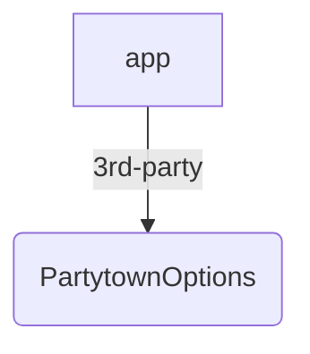

\
&nbsp;

<a href="<https://astro.build>"> <SwmToken path="/packages/astro/src/core/build/plugins/plugin-analyzer.ts" pos="274:3:3" line-data="				const astro = info.meta.astro as AstroPluginMetadata[&#39;astro&#39;];" repo-id="Z2l0aHViJTNBJTNBYXN0cm8lM0ElM0FzaHVqdXV1" repo-name="astro">`astro`</SwmToken></a> is a website build tool for the modern web —&nbsp;\
&nbsp;powerful developer experience meets lightweight output.&nbsp;

 [](https://github.com/withastro/astro/blob/main/LICENSE) [](https://badge.fury.io/js/astro)

Install

The **recommended** way to install the latest version of Astro is by running the command below:

```bash
npm create astro@latest
```

You can also install Astro **manually** by running this command instead:

```bash
npm install --save-dev astro
```

Looking for help? Start with our [Getting Started](https://docs.astro.build/en/getting-started/) guide.

Looking for quick examples? [Open a starter project](https://astro.new/) right in your browser.

## Documentation

Visit our [official documentation](https://docs.astro.build/).

## Support

Having trouble? Get help in the official [Astro Discord](https://astro.build/chat).

## Contributing

**New contributors welcome!** Check out our [Contributors Guide](CONTRIBUTING.md) for help getting started.

Join us on [Discord](https://astro.build/chat) to meet other maintainers. We'll help you get your first contribution in no time!

## Directory

| Package                                                                                                                                                                       | Release Notes                                                                                                                                                        |
| ----------------------------------------------------------------------------------------------------------------------------------------------------------------------------- | -------------------------------------------------------------------------------------------------------------------------------------------------------------------- |
| [astro](packages/astro)                                                                                                                                                       | [](packages/astro/CHANGELOG.md)                                                                    |
| [create-astro](packages/create-astro)                                                                                                                                         | [](packages/create-astro/CHANGELOG.md)                                               |
| [@astrojs/react](packages/integrations/react)                                                                                                                                 | [](packages/integrations/react/CHANGELOG.md)                                              |
| [@astrojs/preact](packages/integrations/preact)                                                                                                                               | [](packages/integrations/preact/CHANGELOG.md)                                            |
| [@astrojs/solid-js](packages/integrations/solid)                                                                                                                              | [](packages/integrations/solid/CHANGELOG.md)                                           |
| [@astrojs/svelte](packages/integrations/svelte)                                                                                                                               | [](packages/integrations/svelte/CHANGELOG.md)                                            |
| [@astrojs/vue](packages/integrations/vue)                                                                                                                                     | [](packages/integrations/vue/CHANGELOG.md)                                                  |
| <SwmPath repo-id="Z2l0aHViJTNBJTNBYXN0cm8lM0ElM0FzaHVqdXV1" repo-name="astro" path="/packages/integrations/lit/">`(astro) packages/integrations/lit/`</SwmPath>               | [](packages/integrations/lit/CHANGELOG.md)                                                  |
| <SwmPath repo-id="Z2l0aHViJTNBJTNBYXN0cm8lM0ElM0FzaHVqdXV1" repo-name="astro" path="/packages/integrations/node/">`(astro) packages/integrations/node/`</SwmPath>             | [](packages/integrations/node/CHANGELOG.md)                                                |
| <SwmPath repo-id="Z2l0aHViJTNBJTNBYXN0cm8lM0ElM0FzaHVqdXV1" repo-name="astro" path="/packages/integrations/vercel/">`(astro) packages/integrations/vercel/`</SwmPath>         | [](packages/integrations/vercel/CHANGELOG.md)                                            |
| <SwmPath repo-id="Z2l0aHViJTNBJTNBYXN0cm8lM0ElM0FzaHVqdXV1" repo-name="astro" path="/packages/integrations/cloudflare/">`(astro) packages/integrations/cloudflare/`</SwmPath> | [](https://github.com/withastro/adapters/blob/main/packages/cloudflare/CHANGELOG.md) |
| <SwmPath repo-id="Z2l0aHViJTNBJTNBYXN0cm8lM0ElM0FzaHVqdXV1" repo-name="astro" path="/packages/integrations/partytown/">`(astro) packages/integrations/partytown/`</SwmPath>   | [](packages/integrations/partytown/CHANGELOG.md)                                      |
| <SwmPath repo-id="Z2l0aHViJTNBJTNBYXN0cm8lM0ElM0FzaHVqdXV1" repo-name="astro" path="/packages/integrations/sitemap/">`(astro) packages/integrations/sitemap/`</SwmPath>       | [](packages/integrations/sitemap/CHANGELOG.md)                                          |
| <SwmPath repo-id="Z2l0aHViJTNBJTNBYXN0cm8lM0ElM0FzaHVqdXV1" repo-name="astro" path="/packages/integrations/tailwind/">`(astro) packages/integrations/tailwind/`</SwmPath>     | [](packages/integrations/tailwind/CHANGELOG.md)                                        |
| <SwmPath repo-id="Z2l0aHViJTNBJTNBYXN0cm8lM0ElM0FzaHVqdXV1" repo-name="astro" path="/packages/integrations/alpinejs/">`(astro) packages/integrations/alpinejs/`</SwmPath>     | [](packages/integrations/alpinejs/CHANGELOG.md)                                        |
| <SwmPath repo-id="Z2l0aHViJTNBJTNBYXN0cm8lM0ElM0FzaHVqdXV1" repo-name="astro" path="/packages/integrations/mdx/">`(astro) packages/integrations/mdx/`</SwmPath>               | [](packages/integrations/mdx/CHANGELOG.md)                                                  |

[](https://bestpractices.coreinfrastructure.org/projects/6178)

Several official projects are maintained outside of this repo:

| Project                                                             | Repository                                                              |
| ------------------------------------------------------------------- | ----------------------------------------------------------------------- |
| [@astrojs/compiler](https://github.com/withastro/compiler)          | [withastro/compiler](https://github.com/withastro/compiler)             |
| [Astro Language Tools](https://github.com/withastro/language-tools) | [withastro/language-tools](https://github.com/withastro/language-tools) |

## Links

- [License (MIT)](LICENSE)
- [Code of Conduct](https://github.com/withastro/.github/blob/main/CODE_OF_CONDUCT.md)
- [Open Governance & Voting](https://github.com/withastro/.github/blob/main/GOVERNANCE.md)
- [Project Funding](https://github.com/withastro/.github/blob/main/FUNDING.md)
- [Website](https://astro.build/)

## Sponsors

Astro is free, open source software made possible by these wonderful sponsors.

[❤️ Sponsor Astro! ❤️](https://github.com/withastro/.github/blob/main/FUNDING.md)

<p align="center"> <a target="\_blank" href="<https://github.com/sponsors/withastro>">

[](https://github.com/sponsors/withastro)

<SwmSnippet path="/package.json" line="4" repo-id="Z2l0aHViJTNBJTNBYXN0cm8lM0ElM0FzaHVqdXV1">

---

Make sure to bump up each patch version for release.

```json
  "version": "0.0.0",
```

---

</SwmSnippet>



Contact <SwmMention uid="7uPWv">[John In](mailto:usertest.swimm@proton.me)</SwmMention> & <SwmMention uid="sLEtk">[Shu-Ju Lin](mailto:shuju@swimm.io)</SwmMention> about the maintenance of this project.

Some integrations that are ready to use in this repo are <SwmToken path="/packages/integrations/partytown/src/index.ts" pos="12:4:4" line-data="export type PartytownOptions = {" repo-id="Z2l0aHViJTNBJTNBYXN0cm8lM0ElM0FzaHVqdXV1" repo-name="astro">`PartytownOptions`</SwmToken> , <SwmToken path="/packages/integrations/tailwind/src/index.ts" pos="56:2:2" line-data="type TailwindOptions = {" repo-id="Z2l0aHViJTNBJTNBYXN0cm8lM0ElM0FzaHVqdXV1" repo-name="astro">`TailwindOptions`</SwmToken> , <SwmToken path="/packages/astro/client.d.ts" pos="406:3:3" line-data="	type MDX = import(&#39;./dist/@types/astro.js&#39;).MDXInstance&lt;Record&lt;string, any&gt;&gt;;" repo-id="Z2l0aHViJTNBJTNBYXN0cm8lM0ElM0FzaHVqdXV1" repo-name="astro">`MDX`</SwmToken> , <SwmToken path="/packages/astro/astro.js" pos="8:1:1" line-data="	NETLIFY: &#39;https://docs.netlify.com/configure-builds/manage-dependencies/#node-js-and-javascript&#39;," repo-id="Z2l0aHViJTNBJTNBYXN0cm8lM0ElM0FzaHVqdXV1" repo-name="astro">`NETLIFY`</SwmToken>.

&nbsp;

<SwmMeta version="3.0.0"><sup>Powered by [Swimm](https://app.swimm.io/)</sup></SwmMeta>
