# README

&#x20;


\
[Astro](%3Chttps:/astro.build%3E) is a website build tool for the modern web — \
powerful developer experience meets lightweight output. \
\
[](https://github.com/withastro/astro/blob/main/LICENSE) [](https://badge.fury.io/js/astro)

### Install

The **recommended** way to install the latest version of Astro is by running the command below:

```bash
npm create astro@latest
```

You can also install Astro **manually** by running this command instead:

```bash
npm install --save-dev astro
```

Looking for help? Start with our [Getting Started](https://docs.astro.build/en/getting-started/) guide.

Looking for quick examples? [Open a starter project](https://astro.new/) right in your browser.

### Documentation

Visit our [official documentation](https://docs.astro.build/).

### Support

Having trouble? Get help in the official [Astro Discord](https://astro.build/chat).

### Contributing

**New contributors welcome!** Check out our [Contributors Guide](CONTRIBUTING.md) for help getting started.

Join us on [Discord](https://astro.build/chat) to meet other maintainers. We'll help you get your first contribution in no time!

### Directory

| Package                                           | Release Notes                                                                                                                                                        |
| ------------------------------------------------- | -------------------------------------------------------------------------------------------------------------------------------------------------------------------- |
| [astro](packages/astro/)                          | [](packages/astro/CHANGELOG.md)                                                                    |
| [create-astro](packages/create-astro/)            | [](packages/create-astro/CHANGELOG.md)                                               |
| [@astrojs/react](packages/integrations/react/)    | [](packages/integrations/react/CHANGELOG.md)                                              |
| [@astrojs/preact](packages/integrations/preact/)  | [](packages/integrations/preact/CHANGELOG.md)                                            |
| [@astrojs/solid-js](packages/integrations/solid/) | [](packages/integrations/solid/CHANGELOG.md)                                           |
| [@astrojs/svelte](packages/integrations/svelte/)  | [](packages/integrations/svelte/CHANGELOG.md)                                            |
| [@astrojs/vue](packages/integrations/vue/)        | [](packages/integrations/vue/CHANGELOG.md)                                                  |
| [@astrojs/lit](packages/integrations/lit/)        | [](packages/integrations/lit/CHANGELOG.md)                                                  |
| [@astrojs/node](packages/integrations/node/)      | [](packages/integrations/node/CHANGELOG.md)                                                |
| [@astrojs/vercel](packages/integrations/vercel/)  | [](packages/integrations/vercel/CHANGELOG.md)                                            |
| `(astro) packages/integrations/cloudflare/`       | [](https://github.com/withastro/adapters/blob/main/packages/cloudflare/CHANGELOG.md) |
| `(astro) packages/integrations/partytown/`        | [](packages/integrations/partytown/CHANGELOG.md)                                      |
| `(astro) packages/integrations/sitemap/`          | [](packages/integrations/sitemap/CHANGELOG.md)                                          |
| `(astro) packages/integrations/tailwind/`         | [](packages/integrations/tailwind/CHANGELOG.md)                                        |
| `(astro) packages/integrations/alpinejs/`         | [](packages/integrations/alpinejs/CHANGELOG.md)                                        |
| `(astro) packages/integrations/mdx/`              | [](packages/integrations/mdx/CHANGELOG.md)                                                  |

[](https://bestpractices.coreinfrastructure.org/projects/6178)

Several official projects are maintained outside of this repo:

| Project                                                             | Repository                                                              |
| ------------------------------------------------------------------- | ----------------------------------------------------------------------- |
| [@astrojs/compiler](https://github.com/withastro/compiler)          | [withastro/compiler](https://github.com/withastro/compiler)             |
| [Astro Language Tools](https://github.com/withastro/language-tools) | [withastro/language-tools](https://github.com/withastro/language-tools) |

### Links

* [License (MIT)](LICENSE/)
* [Code of Conduct](https://github.com/withastro/.github/blob/main/CODE\_OF\_CONDUCT.md)
* [Open Governance & Voting](https://github.com/withastro/.github/blob/main/GOVERNANCE.md)
* [Project Funding](https://github.com/withastro/.github/blob/main/FUNDING.md)
* [Website](https://astro.build/)

### Sponsors

Astro is free, open source software made possible by these wonderful sponsors.

[❤️ Sponsor Astro! ❤️](https://github.com/withastro/.github/blob/main/FUNDING.md)

[](https://github.com/sponsors/withastro)

Boilerplate integration functions can be found by importing `PartytownOptions`, `TailwindOptions`, `MdxOptions`, etc.

```mermaid
graph TD
    A[app] -->|integration| B( VERCEL)
    B --> C{connect successful}

%% Swimm:
%% graph TD
%%     A[app] -->|integration| B( <SwmToken path="/packages/astro/astro.js" pos="11:1:1" line-data="	VERCEL: &#39;https://vercel.com/docs/runtimes#official-runtimes/node-js/node-js-version&#39;," repo-id="Z2l0aHViJTNBJTNBYXN0cm8lM0ElM0FzaHVqdXV1" repo-name="astro">`VERCEL`</SwmToken>)
%%     B --> C{connect successful}
```



***

Please contact [John In](mailto:usertest.swimm@proton.me) & [Shu-Ju Lin](mailto:shuju@swimm.io) for other integration request.

***

To all maintainers, make sure to bump up the patch `version` on every release.

```json
  "version": "0.0.0",
```

***

***

Please refer to [Overview of COP104 Flow](https://app.swimm.io/repos/Z2l0aHViJTNBJTNBa2VsbG8lM0ElM0Fzd2ltbWlv/docs/0260kbeb) on kello repo for more information on how to incorporate with old system.

```cobol
           SELECT COBFIRE ASSIGN TO "c:\COBOL\TOOLS\COBFIRE.DLL"
                  ORGANIZATION IS LINE SEQUENTIAL
                  ACCESS MODE IS SEQUENTIAL.

           SELECT RESPONSE ASSIGN TO ARQUIVO-RESPONSE
                  ORGANIZATION  IS LINE SEQUENTIAL.
```

***

Powered by [Swimm](https://app.swimm.io/)
